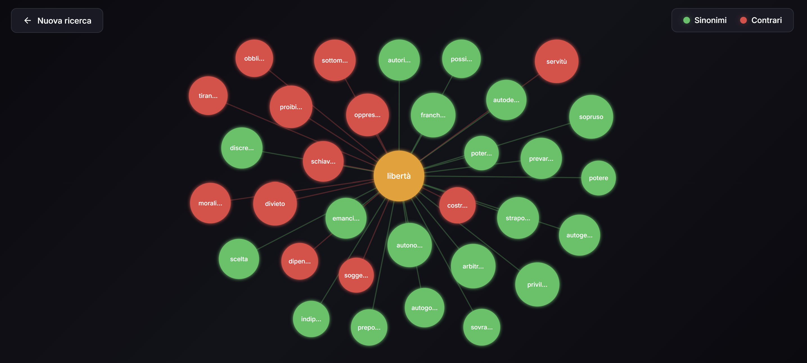

# LexiPop

Web app interattiva per esplorare sinonimi e contrari della lingua italiana attraverso un grafo animato.




## Funzionalità

- Inserisci una parola italiana e visualizza sinonimi e contrari in un grafo esplosivo
- **Nodi verdi**: sinonimi
- **Nodi rossi**: contrari
- **Nodo centrale arancione**: parola cercata
- Clicca su qualsiasi nodo per esplorare quella parola
- Trascina i nodi per riorganizzare il grafo
- Design moderno con sfondo scuro e animazioni fluide

## Tech Stack

- **Backend**: Node.js, Express
- **Scraping**: Axios, Cheerio
- **Frontend**: HTML5, CSS3, JavaScript
- **Grafo**: D3.js
- **Fonte dati**: [Virgilio Sapere](https://sapere.virgilio.it)

## Installazione

```bash
# Clona il repository
git clone https://github.com/tuousername/lexipop.git
cd lexipop

# Installa le dipendenze
npm install

# Avvia il server
npm start
```

Apri il browser su `http://localhost:3000`

## Struttura del progetto

```
lexipop/
├── server.js          # Server Express con API di scraping
├── package.json
├── README.md
└── public/
    ├── index.html     # Pagina principale
    ├── style.css      # Stili (tema scuro, animazioni)
    └── app.js         # Logica del grafo D3.js
```

## API

### GET /api/search/:word

Cerca sinonimi e contrari per una parola.

**Esempio:**
```bash
curl http://localhost:3000/api/search/felice
```

**Risposta:**
```json
{
  "word": "felice",
  "sinonimi": ["contento", "soddisfatto", "appagato", "allegro", "gioioso"],
  "contrari": ["infelice", "scontento", "triste", "malinconico"]
}
```

## Deploy

### Locale
```bash
npm start
```

### Produzione

Il progetto richiede un server Node.js. Piattaforme consigliate:

| Piattaforma | Tipo | Note |
|-------------|------|------|
| **Railway** | Server | Deploy semplice, free tier disponibile |
| **Render** | Server | Free tier con spin-down |
| **Fly.io** | Server | Ottimo per bassa latenza |
| **Vercel** | Serverless | Richiede conversione a API routes |
| **Netlify** | Serverless | Richiede conversione a Netlify Functions |

### Variabili d'ambiente

| Variabile | Default | Descrizione |
|-----------|---------|-------------|
| `PORT` | 3000 | Porta del server |

## Limitazioni

- I dati provengono da web scraping di Virgilio Sapere
- Nessuna cache implementata (ogni ricerca fa una richiesta)
- Nessun rate limiting (consigliato per produzione)
- Solo lingua italiana

## Sviluppi futuri

- [ ] Cache delle risposte
- [ ] Rate limiting
- [ ] Supporto multilingua
- [ ] Salvataggio delle esplorazioni
- [ ] Modalità offline con dizionario locale

## License

MIT
